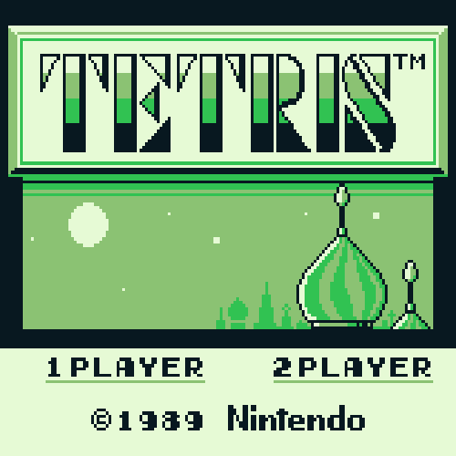

## A gameboy emulator in Rust

Cause that hasnt been done before.

- The code is extremely rough. View at your own discretion.

# Features
- Software Renderer
- Parse and decode instructions from gameboy binaries

---

Render image of Tetris main screen

## TODO
- CPU - Passing blargg's cpu_instr test suite, sans interrupts
  - Pass "02-interrupts.gb"
  - Create Github Action to test these gb files by reading from I/O port
- MEM - Some memory access issues are still in place.
  - Research, fix memory R/W issues
- SOUND
  - This will be a long one. Low priority
- GFX
  - Still some inaccuracies. I will not be implementing the full PPU operations
- WebAssembly Port

## References
- _Writing a Game Boy emulator, Cinoop_, CTurt: https://cturt.github.io/cinoop.html
- _GameBoy Emulation in JavaScript: GPU Timings_, Imran Nazar: http://imrannazar.com/GameBoy-Emulation-in-JavaScript:-GPU-Timings
- _GameBoy Opcode Summary_, Jeff Frohwein: http://www.devrs.com/gb/files/opcodes.html
- _GameBoy CPU Manual_, Pan of Anthrox et al.: https://realboyemulator.files.wordpress.com/2013/01/gbcpuman.pdf
- _Pan Docs_, Pan of ATX et al.: https://gbdev.io/pandocs/
- _mooneye-gb_, Game Boy research project and emulator, Joonas Javanainen: https://github.com/Gekkio/mooneye-gb

---

